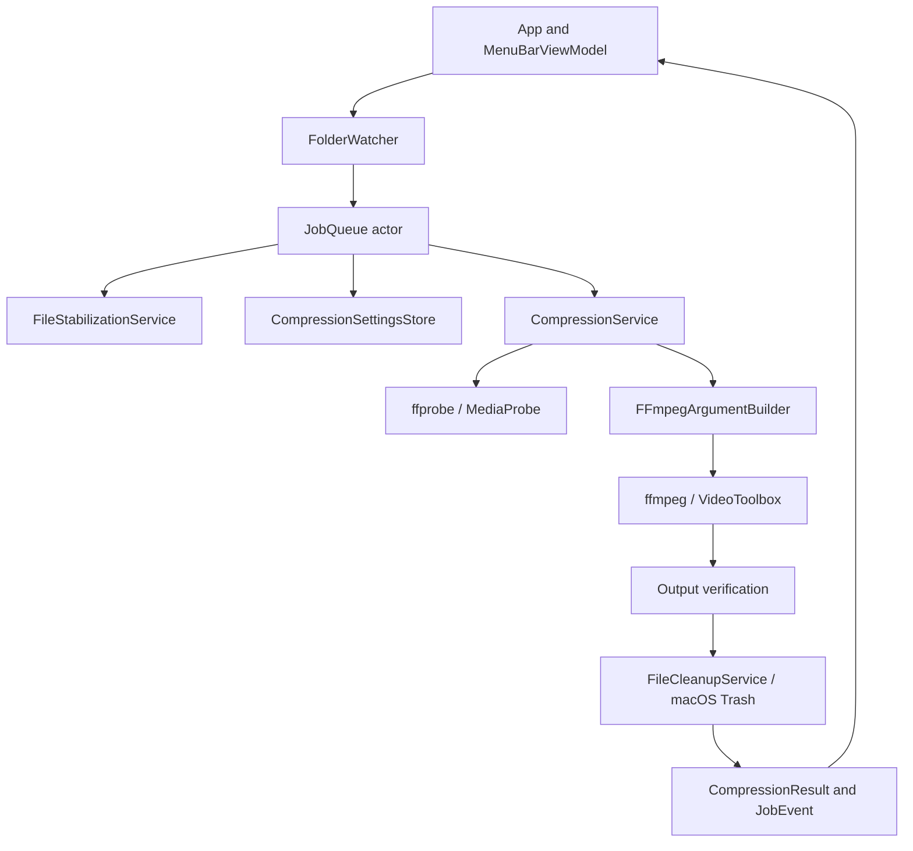

# Screen Compressor architecture

Screen Compressor is a SwiftUI `MenuBarExtra` application for macOS 14+ on Apple Silicon. It watches `~/Screenshots` for completed `.mov` screen recordings, compresses one recording at a time with bundled Apple VideoToolbox FFmpeg tools, verifies the result, and moves the original to Trash only after verification succeeds.

This is the high-level map. Use [Docs/README.md](Docs/README.md) to choose detailed documentation before changing code.

## System overview

The app has no server, database, network API, authentication, authorization, analytics, map, or feature-flag subsystem. External runtime dependencies are macOS frameworks and the FFmpeg/FFprobe executables bundled in the app; Homebrew/PATH locations are fallback-only.

## Main layers

| Layer | Source | Responsibility |
| --- | --- | --- |
| App lifecycle/UI | `ScreenCompressor/App.swift`, `MenuBarView.swift` | Starts/stops services, exposes state, settings, recent results, errors, and launch-at-login. |
| Filesystem intake | `FolderWatcher.swift` | Native directory events and debounce; it does not encode files. |
| Queue coordination | `JobQueue.swift`, `BatchProgress.swift` | Actor-isolated deduplication, serial processing, batch progress, shutdown. |
| File readiness | `Services.swift` | Waits for stable file size without blocking the main actor. |
| Encoding configuration | `CompressionSettings.swift`, `CompressionSettingsStore.swift`, `FFmpegArgumentBuilder.swift` | Presets, advanced controls, persistence, and one settings-to-arguments boundary. |
| Encoding/safety | `CompressionService.swift`, `ProcessRunner.swift`, `Services.swift` | Probes media, runs FFmpeg, validates output, finalizes collision-safe output, and trashes only verified sources. |
| Logging/startup | `LoggingService.swift`, `LaunchAtLoginService.swift` | Rotating lifecycle logs and `SMAppService.mainApp`. |
| Distribution | `Resources/`, `ThirdParty/FFmpeg/`, `scripts/`, `ScreenCompressor.xcodeproj` | Packages, signs, verifies, and optionally notarizes the app. |

## Lifecycle and processing

`ScreenCompressorApp` delegates launch and termination to `AppDelegate`. `MenuBarViewModel.start()` loads persisted settings, creates `~/Screenshots` if needed, creates the queue, starts the watcher, and performs an initial scan. Termination stops the watcher and shuts down the queue.

The queue scans visible regular `.mov` files, canonicalizes and deduplicates them, waits for stable size, snapshots settings, probes the source, and runs FFmpeg to a unique hidden `.processing.mp4` path. The output must be non-empty and, when FFprobe is available, readable media with a positive duration and requested codec. Finalization never overwrites an existing file. Only then is the source moved to Trash.

`MenuBarViewModel` is `@MainActor`; `JobQueue` and `CompressionSettingsStore` are actors. FFmpeg, FFprobe, stabilization waits, and process output are asynchronous.

The critical invariant is: a failed, cancelled, unverified, or cleanup-interrupted compression preserves the original source recording.

## Distribution constraints

- Target: macOS 14+, arm64.
- Bundled tools: `Contents/Resources/bin`; shared libraries: `Contents/Frameworks`.
- FFmpeg 9.0.2 is built without GPL/nonfree components or Homebrew-linked libraries. See [Docs/distribution.md](Docs/distribution.md).
- The Xcode project and `scripts/build.sh` both package and verify the resources.
- Public distribution requires Developer ID signing, hardened runtime, notarization, stapling, and a drag-to-Applications DMG. The repository prepares that flow but cannot supply Apple credentials.

## Detailed documentation

- [Product and workflows](Docs/product.md)
- [Processing and safety data flow](Docs/data-flow.md)
- [Presets and FFmpeg arguments](Docs/compression.md)
- [Build, signing, licensing, and release](Docs/distribution.md)
- [Testing and verification](Docs/testing.md)
