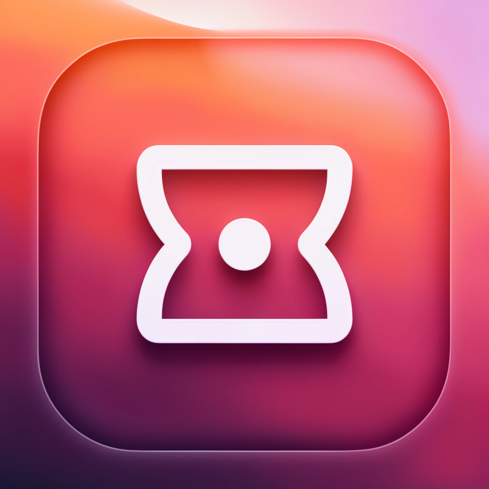
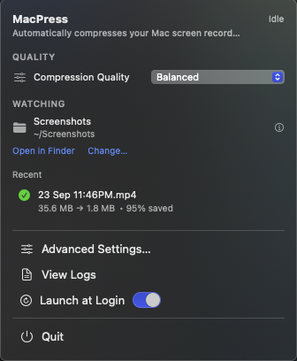
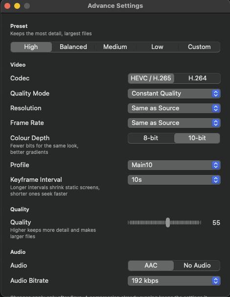
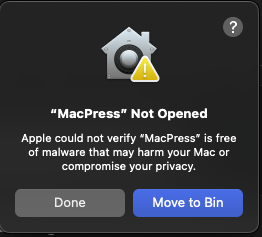
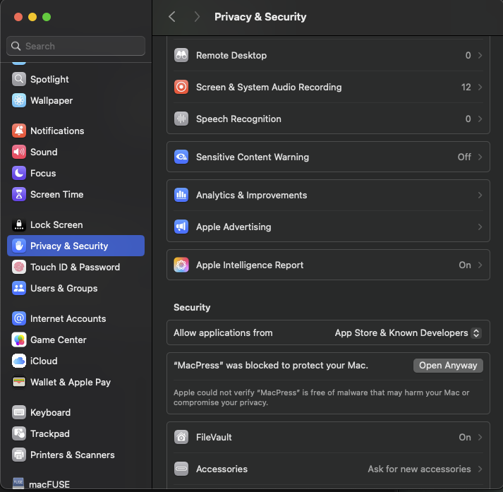
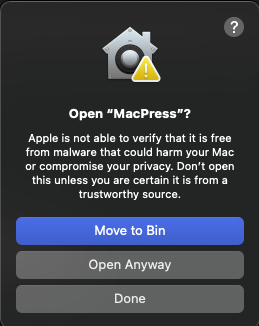

<p align="center">
  
</p>

<h1 align="center">MacPress</h1>

<p align="center">
  <a href="https://www.loom.com/share/9283893b58ca44a2a2d0643697b87678">▶️ Watch the installation guide on Loom</a>
</p>

<p align="center">
  <strong>Your Mac screen recordings. Just much smaller.</strong>
</p>

<p align="center">
  Keep using <kbd>⌘</kbd> <kbd>⇧</kbd> <kbd>5</kbd>.
  MacPress automatically compresses your recordings when you're done.
</p>

<p align="center">
  <a href="#-installation">Installation</a> •
  <a href="#-how-it-works">How it works</a> •
  <a href="/DEVELOPMENT.md">Technical Details</a> 
</p>

<br>

## ✨ Why MacPress?

macOS already has a great screen recorder.

**The file sizes aren't so great.**

MacPress lives quietly in your menu bar and watches your screen-recording folder. When a new `.mov` recording is ready, MacPress automatically compresses it using hardware-accelerated FFmpeg.

No new screen-recording workflow to learn.

Just:

<p align="center">
  <strong>⌘⇧5 &nbsp; → &nbsp; Record &nbsp; → &nbsp; MacPress &nbsp; → &nbsp; Done.</strong>
</p>

---

<h2>MacPress in action</h2>

<table>
  <tr>
    <td width="50%" align="center">
      
      <br>
      <sub>
        <strong>Simple by default.</strong><br>
        Choose your quality, watched folder, and let MacPress handle the rest.
      </sub>
    </td>
    <td width="50%" align="center">
      
      <br>
      <sub>
        <strong>Powerful when you need it.</strong><br>
        Fine-tune compression settings for complete control over your output.
      </sub>
    </td>
  </tr>
</table>

<br>

---

## ⚡ See the difference

<p align="center">
  <strong>Example compression</strong>
</p>

|        Original        |     |        MacPress        |
| :--------------------: | :-: | :--------------------: |
|      **251.7 MB**      |  →  |      **29.9 MB**       |
| `Screen Recording.mov` |     | `Screen Recording.mp4` |
|          100%          |     |    **88% smaller**     |

---

## 🎬 How it works

MacPress doesn't replace the screen recorder built into your Mac.

Keep recording exactly as you already do.

```text
        Record with ⌘⇧5
               │
               ▼
     macOS saves the .mov
               │
               ▼
    MacPress detects the file
               │
               ▼
            Compress
               │
               ▼
    Screen Recording.mp4
               │
               ▼
   Original moved to Trash
    only after verification
```

MacPress watches your configured folder using native filesystem events.

The compressed `.mp4` is saved beside the original recording.

---

## 📦 Installation

MacPress currently supports **Apple Silicon Macs running macOS 14 or later**.

### Download

Download:

[MacPress-arm64.dmg](https://github.com/SagarBajpai/MacPress/releases/latest/download/MacPress-arm64.dmg)

from the project's GitHub Releases page.

Open the DMG and drag **MacPress.app** into your **Applications** folder.

---

### ⚠️ First launch

MacPress is open source, ad-hoc signed, and not notarized. If macOS blocks the first launch:

1. Click **Done** on the warning.

   

2. Open **System Settings → Privacy & Security**, then click **Open Anyway**.

   

3. Click **Open** to confirm.

   

These are per-app exceptions. Do not disable Gatekeeper globally.

---

## 🍺 Homebrew

```bash
brew tap SagarBajpai/macpress
brew trust --cask SagarBajpai/macpress/macpress
brew install --cask macpress
```

To uninstall the Homebrew installation:

```bash
brew uninstall --cask macpress
```

To uninstall MacPress while preserving recordings and the watched folder:

```bash
./scripts/uninstall.sh
```

---

## 📁 Watched Folder

MacPress monitors one configurable folder for new `.mov` files.

On startup, MacPress restores your last explicitly selected watched folder.

On first launch, it may use the observed macOS Screenshot save-location preference as a best-effort hint.

If a suitable location cannot be determined, MacPress asks you to choose a folder.

You can change the watched folder at any time from MacPress.

Compressed videos are saved in the **same folder** as their source recordings.

For example:

```text
Screen Recording 2026-09-24 at 10.30.00.mov
                        │
                        ▼
Screen Recording 2026-09-24 at 10.30.00.mp4
```

---

## 🛠️ Build from source

MacPress can be built locally without an Apple Developer Program membership.

### Clone

```bash
git clone https://github.com/SagarBajpai/macpress.git
cd macpress
```

### Build

```bash
./scripts/build.sh
```

The resulting application is written to:

```text
dist/MacPress.app
```

### Install locally

```bash
./scripts/install.sh
```

Then launch:

```bash
open "$HOME/Applications/MacPress.app"
```

The local application is ad-hoc signed.

## 📄 License

MacPress is released under the [MIT License](LICENSE).

FFmpeg is a separate project distributed under its applicable LGPL license.

See:

[`ThirdParty/FFmpeg/NOTICE.md`](ThirdParty/FFmpeg/NOTICE.md)

and the accompanying source/license files for details.

---

For more Tecnical details check <a href="/DEVELOPMENT.md">Technical Details</a>

<p align="center">
  
</p>

<p align="center">
  <strong>MacPress</strong>
  <br>
  Your Mac screen recordings. Just much smaller.
</p>

<p align="center">
  <sub>Open source • Local-first • Built for Apple Silicon</sub>
</p>
